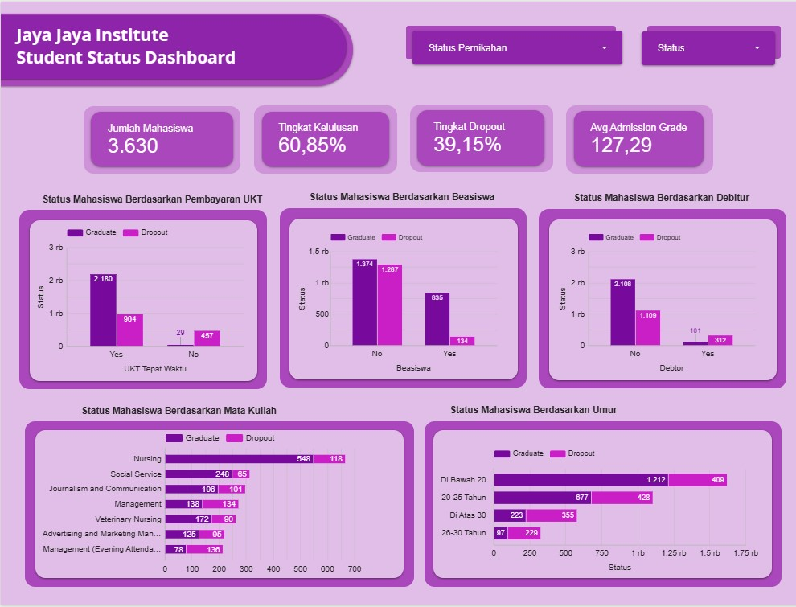

## Proyek Akhir: Menyelesaikan Permasalahan Jaya Jaya Maju Institute

```
.
├── datasets/
│   ├── data.csv
│   ├── student_data_cleaned.csv
│   └── student_data_filtered.csv
├── models/
│   └── rf_model.pkl
├── README.md
├── erlanggs-dashboard.jpg
├── notebook.ipynb
├── app.py
└── requirements.txt
```
---
### Business Understanding
**Jaya Jaya Maju Institut**, sebagai institusi pendidikan tinggi yang telah beroperasi sejak tahun 2000, saat ini menghadapi permasalahan krusial terkait rendahnya tingkat retensi mahasiswa. Fenomena dropout yang tinggi tidak hanya mengancam kredibilitas dan citra institusi, tetapi juga berdampak pada aspek finansial dan operasional pendidikan. Mengingat pentingnya keberlanjutan akademik bagi kesuksesan institusi, manajemen Jaya Jaya Institut membutuhkan pendekatan proaktif berbasis analitik untuk mengantisipasi risiko dropout mahasiswa. Melalui pemanfaatan teknologi data science dan machine learning terhadap informasi akademik serta profil sosial mahasiswa, diharapkan dapat dikembangkan sistem prediksi dini yang memungkinkan implementasi strategi intervensi yang tepat sasaran dan tepat waktu, sehingga dapat meningkatkan angka kelulusan dan optimalisasi sumber daya pendidikan.

---

### Permasalahan Bisnis
Adapun beberapa permasalahan bisnis pada perusahaan Jaya Jaya Maju, antara lain :

* Tingginya jumlah mahasiswa yang mengalami dropout.
* Sulitnya mendeteksi mahasiswa yang berisiko dropout secara dini.
* Tidak adanya sistem prediktif berbasis data untuk memantau performa dan risiko mahasiswa.
* Minimnya dukungan dashboard interaktif untuk pengambilan keputusan akademik.

---
### Cakupan Proyek
Untuk menjawab permasalahan bisnis dari perusahaan ini, perlu dilakukan analisis lebih lanjut. Proyek ini akan menerapkan machine learning teknik klasifikasi dan sebuah business dashboard untuk mempermudah proses identifikasi dan melakukan monitoring berbagai faktor yang menyebabkan tren dropout pada mahasiswa.

* Melakukan analisis terhadap faktor-faktor yang saling berkorelasi terhadap risiko dropout.
* Membangun sebuah model machine learning untuk memprediksi status mahasiswa.
* Menyusun dashboard interaktif untuk membantu monitoring tren dropout mahasiswa.
* Menyediakan prototipe aplikasi prediksi untuk staf akademik.
---

Persiapan 
Sumber data: 
* [Dataset Jaya Jaya Institute Student](https://github.com/dicodingacademy/dicoding_dataset/tree/main/students_performance 'Dicoding GitHub Dataset') 
* [Students' Dropout and Academic Dataset UCIML](https://doi.org/10.24432/C5MC89 'UCI Machine Learning - Predict Students Dropout and Academic Success')
Setup environment: 
```
# Membuat virtual environment
python -m venv .env

# Mengaktifkan virtual environment
.env\Scripts\activate

# Menginstall depedensi yang dibutuhkan
pip install -r requirements.txt

# Menjalankan model prediksi
streamlit run app.py         
```
---
### Business Dashboard
Dashboard ini dirancang khusus untuk memberikan insight mendalam mengenai kondisi akademik mahasiswa dan faktor-faktor yang mempengaruhi tingkat dropout di Jaya Jaya Institut. Dashboard menampilkan metrik penting seperti:

* **Overview Institusi**: Total mahasiswa, tingkat kelulusan, tingkat dropout, dan rata-rata nilai penerimaan mahasiswa.

* **Analisis Demografis**: Distribusi status mahasiswa berdasarkan status pernikahan, kelompok umur, dan profil sosial lainnya.

* **Faktor Finansial**: Korelasi antara status pembayaran UKT, penerima beasiswa, dan status hutang terhadap risiko dropout.

* **Analisis Akademik**: Dampak program studi dan performa akademik terhadap tingkat kelulusan mahasiswa.

Dashboard ini dapat digunakan oleh pihak manajemen akademik untuk memantau kondisi mahasiswa secara real-time, mengidentifikasi mahasiswa berisiko tinggi, dan melakukan intervensi preventif yang diperlukan.

Business Dashboard disusun menggunakan **Looker Studio** yang berfungsi untuk mengidentifikasi faktor-faktor yang mempengaruhi **dropout** mahasiswa pada **Jaya Jaya Institut**. Dashboard ini menyediakan visualisasi yang komprehensif, sehingga dapat mempermudah Staf Akademik dalam melakukan monitoring dan pengambilan keputusan untuk menyelesaikan serta mengurangi persentase **dropout**.

Link Dashbord: [Student Status Analysis Dashboard](https://lookerstudio.google.com/reporting/a2319a38-cd9b-4ddf-8c12-bbba41400c28)


Berikut adalah penjelasan fungsi dari Business Dashboard, antara lain:
Penjelasan Fungsi Business Dashboard:

* **Kontrol Global (Filter)**: Fitur ini berfungsi untuk memfilter dan memfokuskan analisis mahasiswa berdasarkan status pernikahan dan status akademik tertentu, yang memungkinkan **staff akademik** untuk menggali lebih dalam atau membandingkan kondisi antar segmen mahasiswa di seluruh dashboard secara spesifik.

* **Ringkasan Utama (Key Performance Indicator)**: Fitur ini berfungsi untuk menyajikan metrik-metrik kunci seperti total jumlah mahasiswa **(3.630)**, persentase tingkat kelulusan **(60,85%)**, persentase tingkat dropout **(39,15%)**, dan rata-rata nilai penerimaan mahasiswa **(127,29)** secara ringkas dan informatif untuk memberikan gambaran umum kondisi akademik institusi.

* **Analisis Faktor Utama Dropout (Feature Importance Visualizations)**: Fitur ini berfungsi untuk menampilkan visualisasi data mengenai bagaimana faktor-faktor penting seperti pembayaran UKT, status beasiswa, status hutang, program studi, dan kelompok umur berhubungan secara signifikan dengan tingkat dropout mahasiswa. Hal ini membantu manajemen memahami pemicu utama dropout dan mengidentifikasi kelompok mahasiswa yang paling berisiko.

* **Diagram Distribusi Spesifik**: Fitur ini berfungsi untuk menunjukkan komposisi atau distribusi proporsional status mahasiswa (graduate vs dropout) berdasarkan berbagai dimensi seperti ketepatan pembayaran UKT, penerima beasiswa, status hutang, program studi, dan kelompok umur. Visualisasi ini memungkinkan manajemen melihat kontribusi relatif setiap segmen terhadap angka dropout keseluruhan dan mengidentifikasi pola-pola kritis yang memerlukan intervensi khusus.

### Menjalankan Sistem Machine Learning

Sistem machine learning dibangun menggunakan algoritma **Random Forest Classifier** yang dilatih dengan tingkat akurasi sebesar **90,95%**.

Fungsi utama dari sistem adalah untuk melakukan prediksi status mahasiswa dengan kemungkinan **dropout** atau **graduate** berdasarkan input yang diberikan. Input pada sistem ini dibuat berdasarkan Feature Importance dari model **Random Forest**. Berikut adalah link untuk mengakses sistem melalui **Streamlit** atau secara lokal.

**Link Prototype Sistem:**
[Student Status Predictions Streamlit App](https://studentpredictiondashboard.streamlit.app/)

**Menjalankan Sistem Secara Lokal:**
```bash
streamlit run app.py
```
---
### Conclusion
Proyek ini berhasil memberikan solusi komprehensif untuk mengatasi permasalahan dropout mahasiswa di **Jaya Jaya Institut** melalui implementasi **data science** dan **machine learning**.

**Pencapaian Utama**:

1. **Model Prediksi Akurat**, 
Model Random Forest Classifier mencapai akurasi 90,95% dalam memprediksi status mahasiswa, memungkinkan deteksi dini mahasiswa berisiko dropout dengan tingkat kepercayaan tinggi.

2. **Identifikasi Faktor-Faktor Dropout**,
Adapun faktor-faktor utama yang mempengaruhi **dropout** berdasarkan hasil model: **status pembayaran UKT**, **penerima beasiswa**, **status hutang**, **kelompok umur**, **program studi**, **nilai semester (1,2)**, dan **mata kuliah yang lulus**. Temuan ini memberikan wawasan strategis untuk intervensi yang tepat sasaran.

1. **Dashboard Interaktif**
Business Dashboard menggunakan **Looker Studio** menyediakan visualisasi real-time dengan KPI institusi **(3.630 mahasiswa, 60,85% kelulusan, 39,15% dropout)** dan filter interaktif untuk analisis mendalam.

1. **Sistem Prediksi Terintegrasi**
Prototype aplikasi Streamlit memberikan akses langsung bagi staf akademik untuk melakukan prediksi status mahasiswa secara real-time.

Proyek ini membuktikan bahwa pendekatan data-driven sangat efektif dalam menyelesaikan tantangan pendidikan tinggi. Dengan akurasi model tinggi dan dukungan visualisasi interaktif, Jaya Jaya Institut kini memiliki fondasi kuat untuk meningkatkan tingkat retensi mahasiswa.

### Rekomendasi Action Items
Berikut beberapa rekomendasi yang dapat di implementasi oleh perusahaan guna menyelesaikan permasalahan prevalensi dropout.

* **Intervensi Finansial**: Implementasikan sistem cicilan UKT fleksibel dan program konseling finansial wajib untuk mahasiswa dengan masalah pembayaran, memperluas cakupan program beasiswa, dan hutang yang merupakan faktor utama dropout.

* **Support Akademik**: Bentuk program mentoring intensif dan academic support khusus untuk mahasiswa dengan nilai semester 1-2 rendah serta program studi dengan tingkat dropout tinggi.

* **Sistem Monitoring Proaktif**: Gunakan dashboard dan prototype sistem machine learning secara berkala untuk monitoring dan mengidentifikasi tren dropout mahasiswa agar dapat melakukan penanganan secara dini.